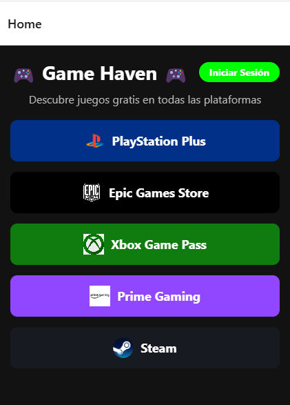
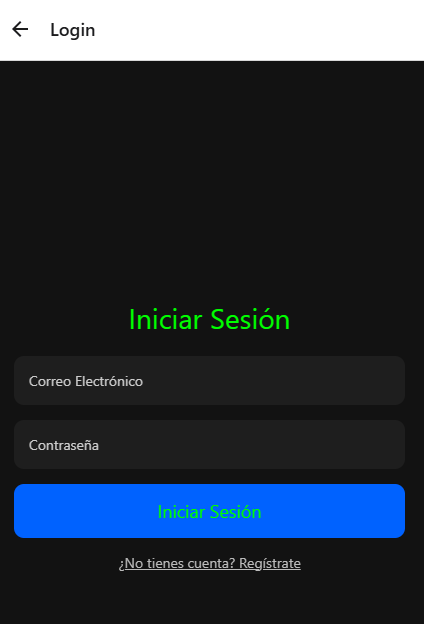
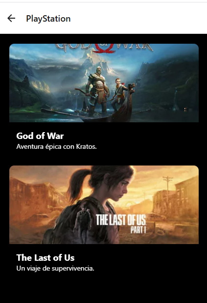
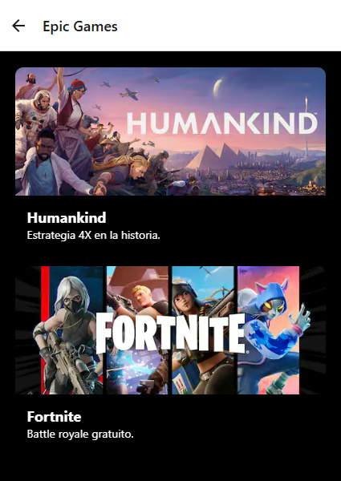
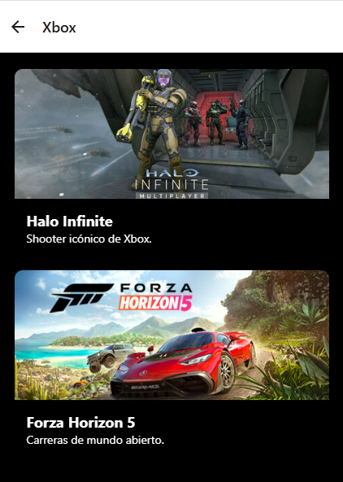
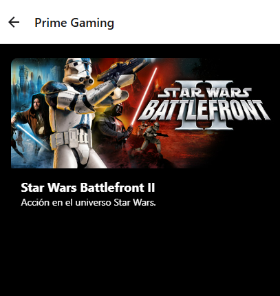
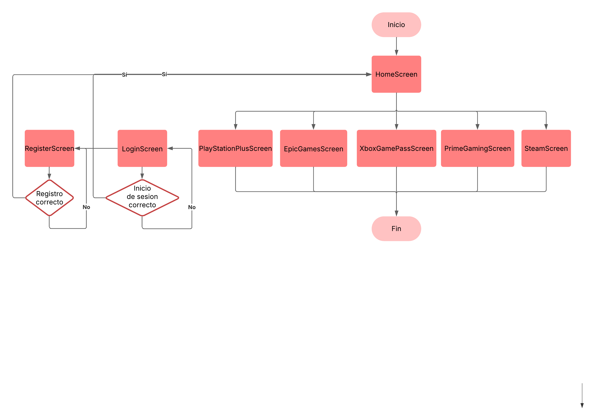

# 🎮 Game Haven  

### Descubre juegos gratuitos en todas tus plataformas favoritas  

---

## 📌 Índice  
1. [Descripción General](#-descripción-general)  
2. [Objetivo General](#-objetivo-general)  
3. [Arquitectura](#-arquitectura)  
4. [Framework Utilizado](#-framework-utilizado)  
5. [Estrategia de Versionamiento](#-estrategia-de-versionamiento)  
6. [Wireframes/Mockups](#-wireframesmockups)  
7. [Diagrama de Flujo](#-diagrama-de-flujo)  
8. [Instalación y Ejecución](#-instalación-y-ejecución)  
9. [Colaboradores](#-colaboradores)  

---

## 📝 Descripción General  
**Game Haven** es una aplicación móvil diseñada para centralizar y mostrar juegos gratuitos disponibles en múltiples plataformas de PC, incluyendo:  
- **PlayStation Plus**  
- **Epic Games Store**  
- **Xbox Game Pass**  
- **Prime Gaming**  
- **Steam**  

La aplicación ofrece una experiencia de usuario intuitiva con pantallas segmentadas por plataforma, detallando los juegos disponibles con su título, imagen y descripción. Además, incluye funcionalidades de autenticación para permitir a los usuarios iniciar sesión y gestionar sus preferencias.  

---

## 🎯 Objetivo General  
Desarrollar una aplicación móvil que permita a los usuarios descubrir y explorar juegos gratuitos en diferentes plataformas de PC, proporcionando una experiencia unificada y amigable.  

---

## 🏛️ Arquitectura  
**Tipo:** **MVC (Modelo-Vista-Controlador)**  

**Justificación:**  
- **Separación de responsabilidades:** Mantiene una clara división entre la lógica de negocio (Modelo), la presentación (Vista) y el flujo de datos/control (Controlador).  
- **Mantenibilidad y escalabilidad:** Facilita la gestión del código a medida que el proyecto crece, permitiendo agregar nuevas funcionalidades sin afectar otras capas.  
- **Modularidad:** Promueve la reutilización de componentes y facilita las pruebas unitarias en las distintas capas.  

---

## ⚙️ Framework Utilizado  
**Framework:** **React Native**  

**Justificación:**  
- **Desarrollo multiplataforma:** Compatible con **iOS** y **Android** usando un solo código base.  
- **Alto rendimiento:** Utiliza componentes nativos para ofrecer una experiencia fluida.  
- **Gran ecosistema y soporte:** Amplia comunidad y disponibilidad de librerías, incluyendo:  
  - `@react-navigation/native` para navegación.  
  - `axios` para consumo de API.  
- **Actualizaciones rápidas:** Integración con Expo para despliegues OTA (Over-The-Air).  

---

## 📈 Estrategia de Versionamiento  
**Modelo:** **SemVer (Semantic Versioning)**  
- **Formato:** `MAJOR.MINOR.PATCH` (Ej: 1.0.0)  
  - **MAJOR:** Cambios incompatibles con versiones anteriores.  
  - **MINOR:** Funcionalidades nuevas, retrocompatibles.  
  - **PATCH:** Correcciones de errores o mejoras menores.  
- **Ramas en Git:**  
  - **main:** Versión estable en producción.  
  - **develop:** Desarrollo activo e integración continua.  
  - **feature/**: Nuevas funcionalidades.  
  - **bugfix/**: Correcciones de errores.  
  - **release/**: Preparación para lanzamiento.  
  - **hotfix/**: Correcciones urgentes en producción.  

---

## 🎨 Wireframes/Mockups  
El diseño inicial de **Game Haven** incluye las siguientes pantallas:  
1. **Inicio (HomeScreen):** Navegación a las pantallas de las diferentes plataformas.  
2. **Iniciar Sesión (LoginScreen):** Autenticación con correo y contraseña.  
3. **Registro :** Registro de datos para realizar inicio de sesion.  
4. **Plataformas de Juegos:** Listas de juegos gratuitos organizadas por plataforma (PlayStation, Epic Games, Xbox, Prime Gaming y Steam).  






Los **wireframes** se adjuntaron anteriormente en formato de imagen.  

---

## 🔄 Diagrama de Flujo  

Inicio
  ↓
HomeScreen
  ↓
 ┌───────────────────────────────────────────────────────────────┐
 |                                                               |
RegisterScreen → (Registro correcto?) → No → RegisterScreen     |
  ↓                            ↓                                 |
LoginScreen          Sí        |                                 |
  ↓                            |                                 |
(Inicio de sesión correcto?) → No → LoginScreen                 |
  ↓                            ↓                                 |
  Sí                          HomeScreen                         |
  ↓                            ↓                                 |
 ┌───────────────────────────────────────────────────────────────┘
 |
PlayStationPlusScreen
EpicGamesScreen
XboxGamePassScreen → Fin
PrimeGamingScreen
SteamScreen

---

## 🚀 Instalación y Ejecución  
**Requisitos Previos:**  
- Node.js (versión LTS recomendada)  
- Expo CLI (opcional, pero recomendado)  
- React Native CLI (en caso de desarrollo nativo)  

**Clonar el repositorio:**  
```bash
git clone https://github.com/usuario/game-haven.git
cd game-haven
